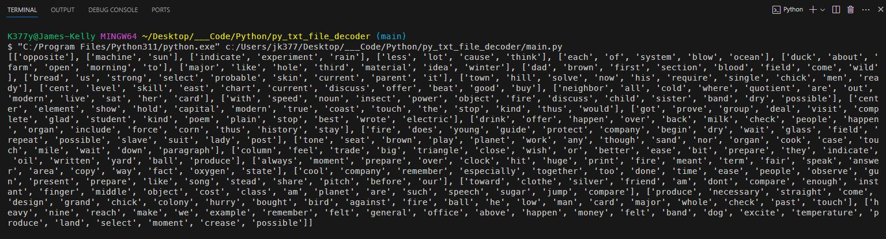

# py_text_decode_assignment

<br>

## *Description*
I had to create a Python script that would take data from a .txt file and then find a secret message embedded within it. The text file consisted of unique numbers and words such as this:<br>

<br>
<br>

The next step I took was to organize that data into a Python dictionary as key value pairs and sort them by the numerical value:<br>

<by>
<by>

The next step was to create a function that would take the dictionary and build a pyramid like structure with the words by putting them into subsets. The structure should look something like:<br>
```
pyramid = { 
        ['opposite'], 
        ['machine', 'sun'], 
        ['indicate', 'experiment', 'rain'], 
        ['less', 'lot', 'cause', 'think'], 
        ['each', 'of', 'system', 'blow', 'ocean'], 
        ['duck', 'about', 'farm', 'open', 'morning', 'to'], ect...
    }
```
Here each subset represented a row and got bigger as the pyramid got taller. The function would then return the pyramid as a list of lists. I only used the numbers to sort the words in the correct order. Now the numbers can be discarded.<br>

<br>
<br>

The last function I created would remove the last word in each subset to find the secret message. I was told the secret message may or may NOT actually make sense.<br>

<br>
<br>


## *Questions*
<h3>Portfolio:&emsp;<a href="https://jk377y.dev" target="_blank">https://jk377y.dev</a></h3>
<h3>Email:&emsp;<a href="mailto:jk377y@gmail.com" target="_blank">jk377y@gmail.com</a></h3>
<h3>LinkedIn:&emsp;<a href="https://www.linkedin.com/in/james-kelly-software-developer/" target="_blank">https://www.linkedin.com/in/james-kelly-software-developer/</a></h3>
<h3>GitHub:&emsp;<a href="https://github.com/jk377y" target="_blank">https://github.com/jk377y</a></h3>
<br>

## *License*
[](https://opensource.org/licenses/MIT)
<br>Copyright (c) 2024 James Kelly
<br>Information on this license can be found at: (https://opensource.org/licenses/MIT)
<br>